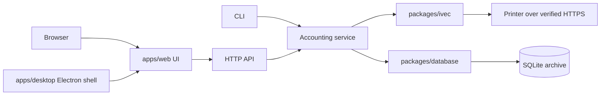

# Architecture

Print Tally is a TypeScript server on Bun with one web UI, delivered through two
equally important surfaces: the web, and an Electron desktop app.

## Package boundaries

| Package | Owns | Never touches |
|---|---|---|
| `packages/contracts` | Runtime schemas and types shared by every other package and the API | I/O of any kind |
| `packages/core` | Identity hashing, exact quantity scaling and exports | Printer sockets, the database |
| `packages/ivec` | The printer protocol: TLS transport, authentication, decryption, paper names | SQLite, user edits, credentials storage |
| `packages/database` | The Drizzle schema, migrations, transactions, history and annotations | The network |
| `apps/server` | Wiring: service, collection schedule, CLI, HTTP API, access control and pairing, printer setup, credential store; serves the built web UI | Protocol or SQL details |
| `apps/web` | The single web UI, used by both the browser and Electron | Printer access, SQL, credentials, accounting rules |
| `apps/desktop` | The Electron app: uses or launches the server on this Mac, or connects to a remote host; loads the web UI; narrow native integrations | Its own UI, business rules, direct database or printer access |

Business rules live in the backend. Clients ask the API for results rather than
recalculating them.

## Surfaces

Both surfaces are first-class. Every feature must work on both.

- **Web** is two surfaces in one. `bunx printtally` starts the server locally and
  opens the UI in the browser. The same server can also run on another machine
  (for example one that stays near the printer) and serve the UI to browsers on
  other devices. The server serves the built UI in both cases.
- **Desktop** is a full Electron app that ships the server as a standalone binary
  (`bun build --compile`, so the user never needs Bun), launches it as a child
  process and loads the same web UI from it. It uses a server already running on
  this Mac if there is one, or connects to a remote host (for example the machine
  next to the printer). The desktop app never serves other devices.
- Every surface reaches everything through the API. There are no desktop-only
  shortcuts, and Electron never puts printer access, SQL or accounting rules in its
  renderer. The CLI exists to start and operate the server.
- In development, one web dev server provides hot reload to both the browser and
  Electron. Changes to Electron's native shell need a restart; UI changes do not.
  Connected to a remote host, the desktop app loads that host's own UI instead, so
  the UI and the API it calls always come from the same server.

## Ownership

One server per machine. Whichever client starts first (`printtally`, `serve` or the
desktop app) owns port 4318 (overridable, never changed silently); the others find
Print Tally answering there and use it. If another program holds the port, the
server exits with an error, and the desktop app says so rather than retrying. That process owns the database, its printer connections
and collection, and quitting it stops the server for every client on the machine.
`printtally collect` goes through a running server when there is one.

## Collection

- The server collects every confirmed printer when it starts, every 15 minutes and
  on request. Collections run one at a time; a request for a printer that is
  already queued or collecting shares that collection.
- A collection reads everything from the printer first, then writes it to the
  archive in a single transaction. No network I/O happens inside a transaction.
- Live collection and snapshot import share one write path (`persistSnapshot`).
  New ways of triggering a collection wrap the existing service rather than adding
  another path into the database.
- If the oldest record the printer still holds is newer than the last one collected
  + 1, the jobs in between were never collected. This is derived from the import
  history, so the warning survives restarts; the health endpoint reports it, naming
  the printer as `health.printers` does. A gap a later collection filled is not reported.
- The database is the source of truth. JSON and CSV exports are conveniences;
  an export failing never undoes an archived import.
- Jobs are never deleted because they drop out of the printer's log. Imports never
  modify user annotations, papers, stock, purchases or write-offs. Costs are worked
  out when read and never stored.

## Trust and credentials

- The printer's root certificate is trusted explicitly, per printer, and only after
  the user has compared its fingerprint with the one shown on the printer.
- Every printer connection checks the certificate chain, a TLS 1.2+ protocol and
  that the certificate names the printer's IP address before sending any bytes.
  There is no plain-HTTP fallback and no way to skip verification.
- Printer passwords live only in the OS credential store. They are never written to
  files, logs, the database or API responses, and no route returns them.
- A password is read only after the printer has proved, over verified TLS, that it
  holds the confirmed root. If a collection fails before that point, the server
  downloads the printer's public root certificate (no credentials) to tell an
  unreachable printer from a changed certificate; a changed one is reported as
  needing confirmation and gets nothing until the user confirms the new fingerprint.
  A newly confirmed root uses a new credential account, so the old password is never
  reused for it.

## Access

- **Same machine: no sign-in.** Requests from loopback need no credentials. Every
  request must name this server in `Host` (`127.0.0.1:<port>` or `localhost:<port>`)
  and, when sent, in `Origin`; that is what stops other web pages in a browser, and
  DNS rebinding, from reaching the API.
- **Other devices: off by default.** The server listens on 127.0.0.1 unless it was
  started with `printtally serve --host`, which listens on all interfaces and prints
  this machine's LAN addresses and hostname with a warning. Connections from the
  network (never from loopback, whose `Host` check stays as above) may name the
  server by those addresses and names, or by any DNS name, such as a Tailscale
  MagicDNS or custom DNS name, whose IPv4 addresses are all this machine's
  non-internal ones. The name is lower-cased, a trailing dot dropped and the port
  must match; IP literals are never looked up. Lookups use the system resolver,
  time out after 2 s, are cached for 60 s (failures too) and fail closed. The
  server does not terminate HTTPS; the docs recommend a home network or Tailscale.
- **Pairing.** `printtally pair` asks the running server, over loopback, for a
  single-use code that expires after 5 minutes, and prints a link
  (`http://<host>:<port>/pair#code=…`, and a `printtally://` form for the desktop
  app) with a terminal QR code. The code travels in the URL fragment, so it never
  reaches server logs or link previews. The `/pair` page exchanges it once for a
  session cookie (`HttpOnly`, `SameSite=Strict`), which the device then sends with
  every request. Remote API requests without a valid session get 401. The desktop app
  opens the `/pair` page in its own window, so the window's session holds the cookie. The UI's
  static files and `/pair` need no session; they hold no data.
- **Sessions** last until revoked with `printtally sessions revoke <id>`, which
  takes effect immediately. Pairing codes are kept only as SHA-256 hashes in
  memory, sessions only as SHA-256 hashes in `sessions.json` in the private data
  folder. Minting codes and listing or revoking sessions is allowed only from this
  machine.

## Serving the UI

The server serves the built UI from `dist/client` beside the server package, falling
back to `../web/dist` when run from source (or `client/` beside a compiled binary).
Paths without a file extension get `index.html`, so the UI's routes work on reload;
hashed files under `assets/` are cached for good, everything else is revalidated.
The API stays under `/api`.

## Packaging

- **npm.** `apps/server` is the published `printtally` package. The `print-accounting-*`
  workspace packages are private, so `bun build --target bun` bundles the CLI and
  everything it imports into `dist/cli.js` (with its `#!/usr/bin/env bun` line), and
  the package has no runtime dependencies. The built UI ships in `dist/client`, and
  Drizzle's migrations are embedded in the code, as for the compiled binary.
- **Compiled server.** `bun build --compile --target bun-darwin-arm64` makes
  `apps/server/dist/printtally-server`, with the UI copied to `client/` beside it.
- **Desktop.** electron-builder packages `apps/desktop` as a macOS arm64 `.app` and
  `.dmg` (`appId` `com.olliespage.PrintTally`) and copies the compiled server and its
  `client/` into `Contents/Resources/server/`, where `server-manager.ts` runs it.
  Everything is signed with Developer ID under the hardened runtime. The app has
  `allow-jit` and `allow-unsigned-executable-memory`; so do Electron's helpers and
  the embedded server, through the inherited entitlements. JavaScriptCore needs
  `allow-jit`: without it the server still runs, but about 9 times slower, because
  it falls back to its interpreter. Electron fuses turn off `ELECTRON_RUN_AS_NODE`,
  `NODE_OPTIONS` and the inspector flags, and the app only loads its own
  integrity-checked `app.asar`. The app registers `printtally://` in its Info.plist.
  Only the release build is notarized.
