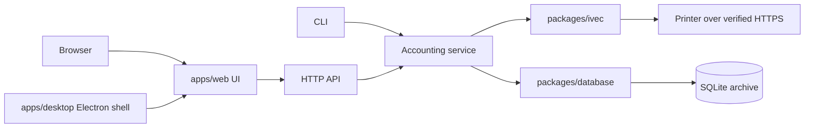

# Architecture

Print Tally is a TypeScript server on Bun with one web UI, delivered through two
equally important surfaces: the web, and an Electron desktop app.

## Package boundaries

| Package | Owns | Never touches |
|---|---|---|
| `packages/contracts` | Runtime schemas and types shared by every other package and the API | I/O of any kind |
| `packages/core` | Identity hashing, exact quantity scaling and exports | Printer sockets, the database |
| `packages/ivec` | The printer protocol: TLS transport, authentication, decryption, paper names | SQLite, user edits, credentials storage |
| `packages/database` | The Drizzle schema, migrations, transactions, history and annotations | The network |
| `apps/server` | Wiring: service, CLI, HTTP API, printer setup, credential store; serves the built web UI | Protocol or SQL details |
| `apps/web` | The single web UI, used by both the browser and Electron | Printer access, SQL, credentials, accounting rules |
| `apps/desktop` | The Electron app: launches its bundled server or connects to a remote one, loads the web UI, narrow native integrations | Its own UI, business rules, direct database or printer access |

Business rules live in the backend. Clients ask the API for results rather than
recalculating them.

## Surfaces

Both surfaces are first-class. Every feature must work on both.

- **Web** is two surfaces in one. `bunx printtally` starts the server locally and
  opens the UI in the browser. The same server can also run on another machine
  (for example one that stays near the printer) and serve the UI to browsers on
  other devices. The server serves the built UI in both cases.
- **Desktop** is a full Electron app that bundles the server and loads the same
  web UI. It either starts its own local server or connects to a remote one (for
  example the machine next to the printer).
- Every surface reaches everything through the API. There are no desktop-only
  shortcuts, and Electron never puts printer access, SQL or accounting rules in its
  renderer. The CLI exists to start and operate the server.
- In development, one web dev server provides hot reload to both the browser and
  Electron. Changes to Electron's native shell need a restart; UI changes do not.

## Ownership

One backend process owns a database, its printer connections and collection.
Collections are serialised within that process, so opening another window or
client never starts a second printer import. Do not run a CLI `collect` against
a printer or database that a running `serve` already owns.

## Collection

- A collection reads everything from the printer first, then writes it to the
  archive in a single transaction. No network I/O happens inside a transaction.
- Live collection and snapshot import share one write path (`persistSnapshot`).
  New ways of triggering a collection (scheduling, progress reporting) wrap the
  existing service rather than adding another path into the database.
- The database is the source of truth. JSON and CSV exports are conveniences;
  an export failing never undoes an archived import.
- Jobs are never deleted because they drop out of the printer's log. Imports never
  modify user annotations, stock mappings or prices.

## Trust and credentials

- The printer's root certificate is trusted explicitly, per printer, and only after
  the user has compared its fingerprint with the one shown on the printer.
- Every printer connection checks the certificate chain, a TLS 1.2+ protocol and
  that the certificate names the printer's IP address before sending any bytes.
  There is no plain-HTTP fallback and no way to skip verification.
- Printer passwords and API tokens live only in the OS credential store. They are
  never written to files, logs, the database or API responses.
- Every API route requires an authenticated client. Serving beyond the local machine
  is an explicit choice, never the default.
